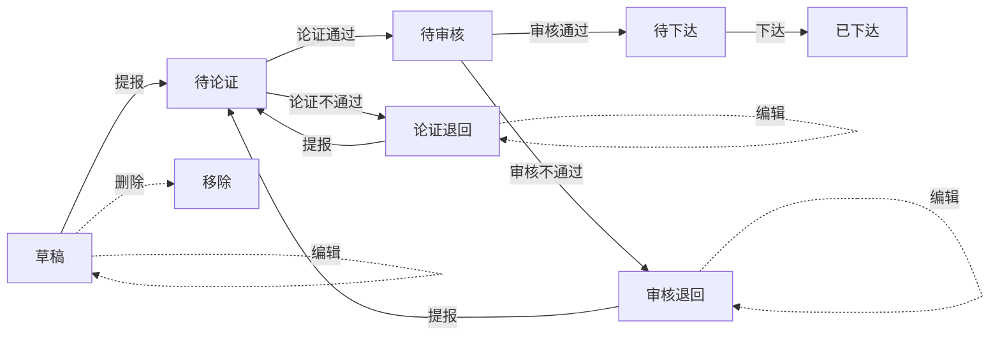

# 后端设计

> 综合计划储备项目管理 —— 后端接口与数据库设计

## 1. 技术概述

- Spring Boot 3.4 + Java 21 + MyBatis-Plus 3.5 + Sa-Token（认证 + 鉴权）
- 统一响应体 `Result<T>`，统一分页 `PageResult<T>`
- 认证方式：Sa-Token，登录后返回 token，请求头 `Authorization` 携带 token（无 Bearer 前缀）
- 权限鉴权：`@SaCheckLogin` / `@SaCheckPermission("模块:操作")`，权限从 `sys_user_role` + `sys_role_menu` 实时加载
- 金额：数据库统一存「元」（`decimal(18,2)`，Java 用 `BigDecimal`），前端展示时换算万元/亿元

## 2. 统一约定

### 2.1 响应体 `Result<T>`

```json
{ "code": 200, "msg": "操作成功", "data": {} }
```

| code | 含义 |
|------|------|
| 200 | 成功 |
| 400 | 业务错误 / 参数校验失败 |
| 401 | 未登录或登录已过期 |
| 403 | 无权限访问 |
| 500 | 系统内部错误 |

### 2.2 分页 `PageResult<T>`

```json
{ "total": 100, "list": [] }
```

分页入参统一使用 `pageNum`（页码，从 1 起）、`pageSize`（每页条数，默认 5）。

### 2.3 字典与状态取值

- **项目状态**（7 态，存库为中文）：`草稿 / 待论证 / 论证退回 / 待审核 / 审核退回 / 待下达 / 已下达`
- **二级分类**（`project_type`，8 类）：`电网基建 / 生产设备技改 / 科技创新 / 营销投入 / 信息化建设 / 固定资产零购 / 战新产业 / 生产辅助`
- **项目来源**（`source`）：`MANUAL`（手动录入）/ `SYNC`（外部拉取）/ `IMPORT`（Excel 导入）

### 2.4 项目编码

`project_code` 格式：`XM` + `yyyyMM` + 3 位序号（如 `XM202408001`），新增时自动生成、按月递增。

## 3. 公共数据结构

### 3.1 登录请求 `LoginBody`

| 字段 | 类型 | 必填 | 说明 |
|------|------|------|------|
| username | String | 是（@NotBlank） | 用户名 |
| password | String | 是（@NotBlank） | 密码 |

### 3.2 登录用户 `LoginUser`

| 字段 | 类型 | 说明 |
|------|------|------|
| token | String | Sa-Token token（仅 login 返回） |
| userId | Long | 用户 ID |
| username | String | 用户名 |
| nickname | String | 昵称 |
| roles | String[] | 角色 key 列表（如 `["admin"]`） |
| permissions | String[] | 权限字符串列表（如 `["project:add"]`） |

### 3.3 项目保存 `ProjectSaveDTO`

| 字段 | 类型 | 必填 | 校验 | 说明 |
|------|------|------|------|------|
| projectName | String | 是 | @NotBlank | 项目名称 |
| projectType | String | 是 | @NotBlank | 二级分类（8 类之一） |
| investmentAmount | BigDecimal | 是 | @NotNull @DecimalMin("0.01") | 投资金额（单位：元） |
| deptId | Long | 是 | @NotNull | 所属部门 ID |
| description | String | 否 | - | 项目描述 |
| planStartDate | LocalDate | 否 | - | 计划开始日期 |
| planEndDate | LocalDate | 否 | - | 计划结束日期 |
| validUntil | LocalDate | 否 | - | 有效期至 |

### 3.4 项目视图 `ProjectVO`

| 字段 | 类型 | 说明 |
|------|------|------|
| id | Long | 主键 |
| projectCode | String | 项目编码 |
| projectName | String | 项目名称 |
| projectType | String | 二级分类 |
| investmentAmount | BigDecimal | 投资金额（元） |
| deptId | Long | 所属部门 ID |
| deptName | String | 所属部门名称 |
| description | String | 项目描述 |
| status | String | 状态（7 态之一） |
| createTime | LocalDateTime | 创建时间 |
| issueTime | LocalDateTime | 下达时间（仅已下达有值） |

### 3.5 论证命令 `ReviewCommand`

| 字段 | 类型 | 必填 | 说明 |
|------|------|------|------|
| infoComplete | String | 否 | 信息完整性：`完整`/`不完整` |
| threeImportant | String | 否 | 三重一大：`符合`/`不符合` |
| splitProject | String | 否 | 拆分立项：`无`/`存在` |
| interfaceConfusion | String | 否 | 界面混淆：`无`/`存在` |
| opinion | String | 否 | 论证意见 |
| pass | Boolean | 是（@NotNull） | 论证结果：true=通过，false=不通过 |

### 3.6 审核命令 `AuditCommand`

| 字段 | 类型 | 必填 | 说明 |
|------|------|------|------|
| opinion | String | 否 | 审核意见 |
| pass | Boolean | 是（@NotNull） | 审核结果：true=通过，false=退回 |

### 3.7 批量审核 `BatchAuditCommand`

| 字段 | 类型 | 必填 | 说明 |
|------|------|------|------|
| ids | List\<Long\> | 是（@NotEmpty） | 待审核项目 ID 列表 |
| pass | Boolean | 是（@NotNull） | true=批量通过，false=批量退回 |

---

## 4. 接口设计

### 4.1 认证 `/api/auth`

#### POST `/api/auth/login` —— 登录

- **权限**：公开
- **入参**：`LoginBody`
- **出参**：`Result<LoginUser>`（data 含 token + 角色 + 权限）
- **逻辑**：按 username 查询用户 → 用户不存在或 BCrypt `matches` 校验失败 → 业务错误「用户名或密码错误」；`status=0` → 「账号已被停用」；通过则 `StpUtil.login(userId)`，返回 token 与权限集。
- **示例**：
  - 请求：`POST /api/auth/login`，`{"username":"admin","password":"123456"}`
  - 响应：`{"code":200,"msg":"操作成功","data":{"token":"...","userId":1,"username":"admin","nickname":"系统管理员","roles":["admin"],"permissions":["project:add","project:edit",...]}}`

#### POST `/api/auth/logout` —— 登出

- **权限**：登录
- **逻辑**：`StpUtil.logout()`
- **出参**：`Result<Void>`

#### GET `/api/auth/me` —— 当前用户信息

- **权限**：登录
- **出参**：`Result<LoginUser>`（data 不含 token）
- **逻辑**：`StpUtil.getLoginIdAsLong()` → 查用户（不存在则 401「用户不存在或已删除」）→ 返回用户信息 + 角色 + 权限。

### 4.2 系统管理 `/api/system`

#### 用户管理

**GET `/api/system/user/page`** —— 分页查询用户

- **权限**：`system:user`
- **入参**：`pageNum`、`pageSize`、`username`（可选，模糊匹配）
- **出参**：`Result<PageResult<SysUserVO>>`，`SysUserVO { id, username, nickname, deptId, status, createTime, roleIds: Long[] }`
- **逻辑**：按 username like 过滤，分页返回；每用户回填 `roleIds`（其拥有的角色）。

**POST `/api/system/user`** —— 新增用户

- **权限**：`system:user`
- **入参**：`SysUserDTO { username(@NotBlank), password(@NotBlank), nickname, deptId, status, roleIds: Long[] }`
- **出参**：`Result<Void>`
- **逻辑**：BCrypt 编码密码 → 插入用户 → 保存 `roleIds` 到 `sys_user_role`（先删后插）。

**PUT `/api/system/user/{id}`** —— 编辑用户

- **权限**：`system:user`
- **入参**：同 POST，`password` 可选（填写则重新 BCrypt 编码）
- **逻辑**：更新用户 + 重建 `sys_user_role`。

**DELETE `/api/system/user/{id}`** —— 删除用户

- **权限**：`system:user`
- **逻辑**：拒绝删除自己；删除用户 + 其 `sys_user_role` 记录。

#### 角色管理

**GET `/api/system/role/list`** —— 角色列表

- **权限**：`system:role`
- **出参**：`Result<List<SysRole>>`，`SysRole { id, roleName, roleKey, sort, status, menuIds: Long[] }`
- **逻辑**：查所有角色，每角色回填 `menuIds`（其拥有的菜单）。

**POST `/api/system/role`** —— 新增角色

- **权限**：`system:role`
- **入参**：`RoleDTO { roleName(@NotBlank), roleKey(@NotBlank), sort, status, menuIds: Long[] }`
- **逻辑**：插入角色 → `assignMenus(roleId, menuIds)` 分配权限。

**PUT `/api/system/role/{id}`** —— 编辑角色

- **权限**：`system:role`
- **入参**：同 POST
- **逻辑**：更新角色 → 重建 `sys_role_menu`（先删后插）。

**DELETE `/api/system/role/{id}`** —— 删除角色

- **权限**：`system:role`
- **逻辑**：删除角色 + 其 `sys_role_menu` 记录。

#### 菜单管理

**GET `/api/system/menu/list`** —— 菜单树（管理用）

- **权限**：`system:menu`
- **出参**：`Result<List<SysMenu>>`（树形，含 `children`）
- **逻辑**：查所有菜单，按 `parentId` 组装树。

**GET `/api/system/menu/routers`** —— 当前用户菜单（侧边栏用）

- **权限**：登录
- **出参**：`Result<List<SysMenu>>`（当前用户可访问的 M/C 菜单树）
- **逻辑**：按 `userId` join `sys_user_role` → `sys_role_menu` → `sys_menu`，过滤 `menuType IN (M,C)` 且 `visible=1`、`status=1`，组装树。

**POST `/api/system/menu`** —— 新增菜单

- **权限**：`system:menu`
- **入参**：`SysMenu { menuName(@NotBlank), menuType(@NotBlank M/C/F), parentId, path, component, perms, icon, sort, visible, status }`

**PUT `/api/system/menu/{id}`** —— 编辑菜单

- **权限**：`system:menu`

**DELETE `/api/system/menu/{id}`** —— 删除菜单

- **权限**：`system:menu`

#### 部门 / 字典

**GET `/api/system/dept/tree`** —— 部门树

- **权限**：登录
- **出参**：`Result<List<SysDept>>`（树形，含 `children`）

**GET `/api/system/dict/{type}`** —— 字典数据

- **权限**：登录
- **出参**：`Result<List<SysDictData>>`
- **逻辑**：按 `dict_type` 查字典数据，按 `sort` 升序。

### 4.3 储备项目维护 `/api/project`

#### GET `/api/project/page` —— 分页列表

- **权限**：登录
- **入参**：`pageNum`、`pageSize`、`projectType`（可选）、`deptId`（可选）、`status`（可选）、`name`（可选，项目名称模糊）
- **出参**：`Result<PageResult<ProjectVO>>`
- **逻辑**：按条件 eq/like 过滤，`create_time desc` 排序分页。
- **示例**：`GET /api/project/page?pageNum=1&pageSize=5&status=草稿` → `{"code":200,"data":{"total":3,"list":[{...ProjectVO}]}}`

#### GET `/api/project/{id}` —— 详情

- **权限**：登录
- **出参**：`Result<ProjectVO>`

#### POST `/api/project` —— 新增项目

- **权限**：`project:add`
- **入参**：`ProjectSaveDTO`
- **出参**：`Result<Long>`（data 为新项目 id）
- **逻辑**：校验通过 → 生成 `projectCode` → `status="草稿"`、`source="MANUAL"`、`createBy=当前用户` → 入库 → 返回 id。
- **示例**：`POST /api/project`，`{"projectName":"川南电网改造","projectType":"电网基建","investmentAmount":500000,"deptId":2}` → `{"code":200,"msg":"操作成功","data":1}`

#### PUT `/api/project/{id}` —— 编辑项目

- **权限**：`project:edit`
- **入参**：`ProjectSaveDTO`
- **逻辑**：仅 `草稿/论证退回/审核退回` 可编辑，否则业务错误。

#### DELETE `/api/project/{id}` —— 删除项目

- **权限**：`project:delete`
- **逻辑**：仅 `草稿` 可删除，否则业务错误。

#### POST `/api/project/submit/{id}` —— 提报

- **权限**：`project:submit`
- **逻辑**：`草稿/论证退回/审核退回` → `待论证`；其余状态抛业务错误。

#### POST `/api/project/submit/batch` —— 批量提报

- **权限**：`project:submit`
- **入参**：body `List<Long>`（项目 ID 列表）
- **逻辑**：事务内逐个提报，空列表抛业务错误；任一失败整体回滚。

#### GET `/api/project/export` —— 导出 CSV

- **权限**：`project:export`
- **出参**：CSV 文件（UTF-8 BOM），`Content-Disposition: attachment; filename=储备项目_<yyyyMMdd>.csv`
- **逻辑**：按当前筛选条件导出。

#### GET `/api/project/stats` —— 统计卡片

- **权限**：登录
- **出参**：`Result<Map>`，`{ total, draft, reviewRejected, auditRejected }`（项目总数 / 草稿 / 论证退回 / 审核退回）

### 4.4 储备项目论证 `/api/review`

> 「论证通过」为派生视图：即 `status=待审核` 的项目；「论证不通过」即 `status=论证退回`。

#### GET `/api/review/page` —— 分页列表

- **权限**：`review:view`
- **入参**：`pageNum`、`pageSize`、`name`（可选）、`projectType`（可选）、`status`（可选：待论证/论证通过/论证退回，`论证通过` 映射为 `待审核`）
- **出参**：`Result<PageResult<ProjectVO>>`
- **逻辑**：查询 `status IN ('待论证','待审核','论证退回')` 的项目。

#### GET `/api/review/{id}` —— 详情

- **权限**：`review:view`
- **出参**：`Result<ReviewDetailVO>`（project + 最新论证记录：4 检查项 + 论证意见 + 论证结果 + 论证时间）

#### POST `/api/review/{id}/execute` —— 执行论证

- **权限**：`review:execute`
- **入参**：`ReviewCommand`
- **出参**：`Result<Void>`
- **逻辑**：仅 `待论证` 可论证（否则业务错误）→ 插入 `project_review` 记录 → `pass=true` 状态改 `待审核`，`pass=false` 状态改 `论证退回`（事务）。
- **示例**：`POST /api/review/1/execute`，`{"infoComplete":"完整","threeImportant":"符合","splitProject":"无","interfaceConfusion":"无","opinion":"论证通过","pass":true}` → `{"code":200,"msg":"操作成功"}`

#### GET `/api/review/stats` —— 统计

- **权限**：`review:view`
- **出参**：`Result<Map>`，`{ pending, passed, rejected, passRate }`，`passRate = passed/(passed+rejected)*100`（百分比，1 位小数）

### 4.5 储备项目审核 `/api/audit`

> 「审核通过」为派生视图：即 `status=待下达` 的项目；「审核退回」即 `status=审核退回`。

#### GET `/api/audit/page` —— 分页列表

- **权限**：`audit:view`
- **入参**：`pageNum`、`pageSize`、`name`（可选）、`projectType`（可选）、`status`（可选：待审核/审核通过/审核退回，`审核通过` 映射为 `待下达`）
- **出参**：`Result<PageResult<ProjectVO>>`
- **逻辑**：查询 `status IN ('待审核','待下达','审核退回')` 的项目。

#### GET `/api/audit/{id}` —— 详情

- **权限**：`audit:view`
- **出参**：`Result<AuditDetailVO>`（project + 最新审核记录 + 最新论证结论 `reviewResult`/`reviewOpinion`）

#### POST `/api/audit/{id}/execute` —— 执行审核

- **权限**：`audit:execute`
- **入参**：`AuditCommand`
- **出参**：`Result<Void>`
- **逻辑**：仅 `待审核` 可审核（否则业务错误）→ 插入 `project_audit` 记录 → `pass=true` 状态改 `待下达`，`pass=false` 状态改 `审核退回`（事务）。

#### POST `/api/audit/batch` —— 批量审核

- **权限**：`audit:batch`
- **入参**：`BatchAuditCommand`
- **出参**：`Result<Void>`
- **逻辑**：事务内逐个审核，空列表抛业务错误；任一失败整体回滚。

#### GET `/api/audit/stats` —— 统计

- **权限**：`audit:view`
- **出参**：`Result<Map>`，`{ pending, passed, rejected, passRate }`（同论证口径）

### 4.6 统一储备库 `/api/reserve`

> 储备库 = `status ∈ {待下达, 已下达}` 的项目。

#### GET `/api/reserve/page` —— 分页列表

- **权限**：`reserve:view`
- **入参**：`pageNum`、`pageSize`、`name`（可选）、`projectType`（可选）、`deptId`（可选）、`status`（可选：待下达/已下达）
- **出参**：`Result<PageResult<ProjectVO>>`

#### GET `/api/reserve/{id}` —— 详情

- **权限**：`reserve:view`
- **出参**：`Result<ReserveDetailVO>`（project + 最新论证/审核记录 + 下达时间）

#### POST `/api/reserve/{id}/issue` —— 下达

- **权限**：`reserve:issue`
- **出参**：`Result<Void>`
- **逻辑**：仅 `待下达` 可下达（否则业务错误）→ 状态改 `已下达` 并记录 `issueTime`。

#### GET `/api/reserve/export` —— 导出 CSV

- **权限**：`reserve:export`
- **出参**：CSV（UTF-8 BOM），`统一储备库_<yyyyMMdd>.csv`

#### GET `/api/reserve/stats` —— 统计 + 图表聚合

- **权限**：`reserve:view`
- **出参**：`Result<ReserveStatsVO>`：
  - `total`（总数）、`totalAmountYuan`（总投资，元，BigDecimal）、`pending`（待下达）、`issued`（已下达）
  - `categoryDist: [{name,value}]`（按 project_type 分组数量）
  - `deptDist: [{name,value}]`（按部门分组数量）

---

## 5. 数据库设计（数据字典）

> 所有表统一含审计字段 `create_by`(bigint)、`create_time`(datetime)、`update_by`(bigint)、`update_time`(datetime)，由 MyBatis-Plus `MetaObjectHandler` 自动填充。索引命名：主键 `pk_*`、唯一 `uk_*`、普通 `idx_*`。

### 5.1 sys_user（用户）

| 字段 | 类型 | 空 | 默认 | 说明 |
|------|------|----|------|------|
| id | bigint | 否 | 自增 | 主键 |
| username | varchar(64) | 否 | - | 用户名（唯一 `uk_sys_user_username`） |
| password | varchar(128) | 否 | - | BCrypt 加盐哈希 |
| nickname | varchar(64) | 是 | - | 昵称 |
| dept_id | bigint | 是 | - | 所属部门（`idx_sys_user_dept`） |
| status | tinyint | 是 | 1 | 状态：1 启用 / 0 停用 |
| create_by / create_time / update_by / update_time | - | 是 | - | 审计字段 |

### 5.2 sys_role（角色）

| 字段 | 类型 | 空 | 默认 | 说明 |
|------|------|----|------|------|
| id | bigint | 否 | 自增 | 主键 |
| role_name | varchar(64) | 否 | - | 角色名 |
| role_key | varchar(64) | 否 | - | 角色标识（唯一 `uk_sys_role_key`，如 `admin`） |
| sort | int | 是 | 0 | 排序 |
| status | tinyint | 是 | 1 | 状态 |
| 审计字段 | - | 是 | - | 见上 |

### 5.3 sys_menu（菜单 / 权限）

| 字段 | 类型 | 空 | 默认 | 说明 |
|------|------|----|------|------|
| id | bigint | 否 | 自增 | 主键 |
| menu_name | varchar(64) | 否 | - | 菜单名 |
| parent_id | bigint | 是 | 0 | 上级 ID（`idx_sys_menu_parent`） |
| path | varchar(200) | 是 | - | 路由地址 |
| component | varchar(200) | 是 | - | 组件路径 |
| perms | varchar(100) | 是 | - | 权限标识（如 `project:add`） |
| menu_type | char(1) | 否 | - | 类型：M 目录 / C 菜单 / F 按钮 |
| icon | varchar(64) | 是 | - | 图标 |
| sort | int | 是 | 0 | 排序 |
| visible | tinyint | 是 | 1 | 是否可见 |
| status | tinyint | 是 | 1 | 状态 |
| 审计字段 | - | 是 | - | 见上 |

### 5.4 sys_dept（部门）

| 字段 | 类型 | 空 | 默认 | 说明 |
|------|------|----|------|------|
| id | bigint | 否 | 自增 | 主键 |
| dept_name | varchar(64) | 否 | - | 部门名 |
| parent_id | bigint | 是 | 0 | 上级 ID（`idx_sys_dept_parent`） |
| sort | int | 是 | 0 | 排序 |
| status | tinyint | 是 | 1 | 状态 |
| 审计字段 | - | 是 | - | 见上 |

### 5.5 sys_dict_type（字典类型）

| 字段 | 类型 | 空 | 默认 | 说明 |
|------|------|----|------|------|
| id | bigint | 否 | 自增 | 主键 |
| dict_name | varchar(128) | 否 | - | 字典名 |
| dict_type | varchar(64) | 否 | - | 字典类型（唯一 `uk_sys_dict_type`） |
| status | tinyint | 是 | 1 | 状态 |
| remark | varchar(256) | 是 | - | 备注 |
| 审计字段 | - | 是 | - | 见上 |

### 5.6 sys_dict_data（字典数据）

| 字段 | 类型 | 空 | 默认 | 说明 |
|------|------|----|------|------|
| id | bigint | 否 | 自增 | 主键 |
| dict_type | varchar(64) | 否 | - | 字典类型（唯一 `uk_sys_dict_data(dict_type, dict_value)`） |
| dict_label | varchar(128) | 否 | - | 显示标签 |
| dict_value | varchar(128) | 否 | - | 字典值 |
| sort | int | 是 | 0 | 排序 |
| status | tinyint | 是 | 1 | 状态 |
| 审计字段 | - | 是 | - | 见上 |

### 5.7 sys_user_role（用户-角色关联）

| 字段 | 类型 | 空 | 说明 |
|------|------|----|------|
| user_id | bigint | 否 | 用户 ID（联合主键） |
| role_id | bigint | 否 | 角色 ID（联合主键；`idx_sys_user_role_role`） |
| 审计字段 | - | 是 | 见上 |

### 5.8 sys_role_menu（角色-菜单关联）

| 字段 | 类型 | 空 | 说明 |
|------|------|----|------|
| role_id | bigint | 否 | 角色 ID（联合主键） |
| menu_id | bigint | 否 | 菜单 ID（联合主键；`idx_sys_role_menu_menu`） |
| 审计字段 | - | 是 | 见上 |

### 5.9 project（储备项目）

| 字段 | 类型 | 空 | 默认 | 说明 |
|------|------|----|------|------|
| id | bigint | 否 | 自增 | 主键 |
| project_code | varchar(32) | 否 | - | 项目编码（唯一 `uk_project_code`，`XM+yyyyMM+3位`） |
| project_name | varchar(128) | 否 | - | 项目名称 |
| project_type | varchar(64) | 否 | - | 二级分类（8 类，`idx_project_type`） |
| investment_amount | decimal(18,2) | 否 | - | 投资金额（元） |
| dept_id | bigint | 是 | - | 所属部门（`idx_project_dept`） |
| plan_start_date | date | 是 | - | 计划开始日期 |
| plan_end_date | date | 是 | - | 计划结束日期 |
| valid_until | date | 是 | - | 有效期至 |
| description | varchar(512) | 是 | - | 项目描述 |
| status | varchar(32) | 否 | - | 状态（7 态，`idx_project_status_time(status, create_time)`） |
| source | varchar(32) | 是 | MANUAL | 来源：MANUAL/SYNC/IMPORT |
| issue_time | datetime | 是 | - | 下达时间 |
| 审计字段 | - | 是 | - | 见上 |

### 5.10 project_review（论证记录）

| 字段 | 类型 | 空 | 说明 |
|------|------|----|------|
| id | bigint | 否 | 主键 |
| project_id | bigint | 否 | 项目 ID（`idx_project_review_project`） |
| info_complete | varchar(16) | 是 | 信息完整性：完整/不完整 |
| three_important | varchar(16) | 是 | 三重一大：符合/不符合 |
| split_project | varchar(16) | 是 | 拆分立项：无/存在 |
| interface_confusion | varchar(16) | 是 | 界面混淆：无/存在 |
| opinion | varchar(512) | 是 | 论证意见 |
| result | varchar(16) | 否 | 论证结果：通过/不通过 |
| review_by | bigint | 是 | 论证人 |
| review_time | datetime | 是 | 论证时间 |
| 审计字段 | - | 是 | 见上 |

### 5.11 project_audit（审核记录）

| 字段 | 类型 | 空 | 说明 |
|------|------|----|------|
| id | bigint | 否 | 主键 |
| project_id | bigint | 否 | 项目 ID（`idx_project_audit_project`） |
| opinion | varchar(512) | 是 | 审核意见 |
| result | varchar(16) | 否 | 审核结果：通过/退回 |
| audit_by | bigint | 是 | 审核人 |
| audit_time | datetime | 是 | 审核时间 |
| 审计字段 | - | 是 | 见上 |

---

## 6. 状态机与业务规则

> 整体状态链路：项目从「草稿」起步，经论证、审核两道关口推进至「已下达」；论证/审核不通过则退回，退回后重新提报回到「待论证」。实线为状态流转，虚线为不推进链路的编辑/删除操作。



| 当前状态 | 所属模块 | 可执行操作 | 目标状态 |
|---------|---------|-----------|---------|
| 草稿 | 维护 | 编辑 / 删除 / 提报 | 草稿（更新）/ 移除 / 待论证 |
| 论证退回 | 维护 | 编辑 / 提报 | 待论证 |
| 审核退回 | 维护 | 编辑 / 提报 | 待论证 |
| 待论证 | 论证 | 论证通过 / 论证不通过 | 待审核 / 论证退回 |
| 待审核 | 审核 | 审核通过 / 审核不通过 | 待下达 / 审核退回 |
| 待下达 | 统一储备库 | 下达 | 已下达（记录 issueTime） |
| 已下达 | 统一储备库 | 查看 | — |

- 所有状态流转由 `ProjectService` 显式转移白名单校验，非法转移抛业务异常；写操作 `@Transactional`。
- 论证/审核结论落库到 `project_review` / `project_audit`（含历史），项目 `status` 作为唯一事实源。
- 通过率口径：论证通过率 = 通过数 ÷（通过数 + 不通过数）×100%；审核通过率同理（均不含待处理项）。
